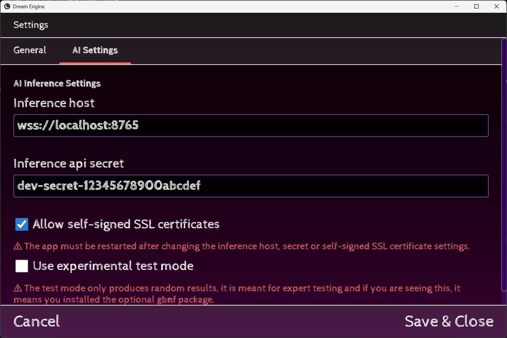

# Dreamengine Servers

These servers are meant for single users, either locally or running on a remote server, they do not have any security by default nevertheless.
    
## local-llama.js

Best for machines that cannot fit the entire model in VRAM, it runs a simple nodejs server with llama.cpp

Prepare by calling `npm install`

Test that GPU inference works by doing `node test.js [path-to-config]`

Run the server with `node local-llama.js [path-to-config]`

## local-llama.py

Best for machines that can fit the entire model in VRAM, in fact it will not work if it cannot, as it uses vllm as the backend.

Prepare by calling `python -m pip install -r requirements.txt` or `pip install -r requirements.txt`

Test that it works by doing `python test.py [path-to-config]`

If you get a warning message about missing the tokenizer because of using a gguf file, you can get the tokenizer by calling `save-tokenizer.py [path-to-gguf]` and add that to the
config `tokenizerPath` that should speed thigns up

vllm expect `enforceEager` to be specified, keep it at false for faster inference, true for faster cold starts.

## Deployment style servers

The python version is recommended when using online services as it uses vllm and it is better optimized on inference jobs.

Some example scripts that will setup an environment are available for use, call them as:

`bash ./scripts/[script-name].sh`

Check the content of the script as it depends on hardware.

## Model Config JSON file

The config file controls which model is loaded and how text is generated. Both `local-llama.js` and `local-llama.py` accept the same format.

### Top-level fields

| Field | Type | Required | Description |
|---|---|---|---|
| `modelPath` | string | yes | Path to the model file, relative to the config JSON. |
| `mode` | string | yes | Chat template to use. Must be one of: `mistral`, `llama3`, `chatml`, `gemma`, `phi`, `deepseek`, `alpaca`. Pick the one that matches your model family. |
| `enforceEager` | boolean | Python only | Set `false` for faster inference (CUDA graphs), `true` for a faster cold start. |
| `tokenizerPath` | string | no | Path to a pre-saved HuggingFace tokenizer directory. Only needed for the Python server when loading a GGUF file (vLLM cannot extract the tokenizer from GGUF directly). Run `save-tokenizer.py` to generate this. |

### `standard` — roleplay / story generation

Used when the engine is generating narrative text, dialogue, or any creative continuation. You generally want **higher temperature** and creativity-preserving samplers here.

| Field | Type | Description |
|---|---|---|
| `temperature` | number | Base sampling temperature. Higher = more random. |
| `dynamicTemperature` | `[min, max]` | When set, temperature is picked randomly from this range on each request instead of using the fixed value above. Good for preventing repetitive outputs across many generations. |
| `minP` | number | Minimum probability threshold. Filters out tokens whose probability is below `minP × (probability of the most likely token)`. A value around `0.02`–`0.05` works well. |
| `topP` | number | Nucleus sampling cutoff (optional). |
| `repeatPenalty` | number | Penalty multiplier applied to recently seen tokens. |
| `frequencyPenalty` | number | Penalises tokens proportionally to how often they have appeared so far. |
| `presencePenalty` | number | Flat penalty for any token that has appeared at all. |
| `maxTokens` | number | Hard cap on generated tokens per request. |
| `dry` | object | **DRY sampler** — discourages repeating sequences of tokens. Fields: `multiplier` (strength), `base` (exponential growth rate), `length` (minimum sequence length to penalise). |
| `xtc` | object | **XTC sampler** — randomly drops high-probability tokens to force more diverse word choice. Do not use `dry` and `xtc` at the same time. |

### `analyze` — structured / analytical generation

Used when an internal agent is running inference to extract structured data from the story context (emotion states, bond values, scene summaries, etc.). You generally want **lower temperature** and more deterministic samplers here so that JSON / structured output is reliable.

| Field | Type | Description |
|---|---|---|
| `temperature` | number | Lower values (0.2–0.5) produce more consistent, predictable output. |
| `topP` | number | Nucleus sampling — combined with low temperature this tightly constrains the output distribution. |
| `topK` | number | Keep only the top-K most likely tokens at each step. |
| `repeatPenalty` | number | Discourages the model from looping the same phrase. |
| `frequencyPenalty` | number | See above. |
| `presencePenalty` | number | See above. |
| `maxTokens` | number | Usually kept equal to or smaller than the `standard` limit since analytical responses are short. |

### Example — Mistral / creative roleplay focus

```json
{
    "modelPath": "./models/Mistral-7B-Instruct-v0.3-Q8_0.gguf",
    "mode": "mistral",
    "standard": {
        "temperature": 1.0,
        "dynamicTemperature": [0.8, 1.05],
        "minP": 0.025,
        "dry": {
            "multiplier": 0.8,
            "base": 1.74,
            "length": 5
        },
        "maxTokens": 1024
    },
    "analyze": {
        "temperature": 0.4,
        "topP": 0.8,
        "topK": 40,
        "repeatPenalty": 1.1,
        "frequencyPenalty": 0.0,
        "presencePenalty": 0.0,
        "maxTokens": 512
    }
}
```

### Example — Llama 3 with tokenizer (for python VLLM backend)

```json
{
    "modelPath": "./models/Meta-Llama-3-70B-Instruct",
    "mode": "llama3",
    "enforceEager": false,
    "tokenizerPath": "./models/tokenizer/llama3",
    "standard": {
        "temperature": 1.0,
        "dynamicTemperature": [0.75, 1.1],
        "minP": 0.02,
        "maxTokens": 1024
    },
    "analyze": {
        "temperature": 0.3,
        "topP": 0.85,
        "maxTokens": 512
    }
}
```

### Example — Qwen / ChatML family

```json
{
    "modelPath": "./models/Qwen2.5-72B-Instruct",
    "mode": "chatml",
    "enforceEager": false,
    "standard": {
        "temperature": 0.9,
        "minP": 0.03,
        "maxTokens": 2048
    },
    "analyze": {
        "temperature": 0.2,
        "topP": 0.9,
        "maxTokens": 512
    }
}
```

## Downloading a model

The models exist at the models directory, you can download them by calling `download-models.sh` and following the instructions, this will download the models to the `models` directory.

You need to call the script using `python3 download-model.py <model-type> <model-name>` to download from huggingface

## Environment Variables

### DEBUG

`0` or `1`, Default is `0`, if set to `1` the server will print debug messages to the console, this can be useful for debugging issues with the server.

### DEV

`0` or `1`, Default is `0`, if set to `1` the server will run in development mode.

Development mode will make the server secret to become `dev-secret-12345678900abcdef`

### SSL

`0` or `1`, Default is `0`, if set to `1` the server will run with SSL, you may want to run `create-ssl-keys.sh` to create the keys for the server.

## Secret File

Initializing a server will create a secret file that contains the API secret, it exists at the same directory as the server script and is named `secret`, you can read the secret from this file to connect to the server, or you can set the `DEV` environment variable to `1` to use the development secret.

## Example Initialization (nodejs)

This walkthrough downloads a model from HuggingFace, generates a config, starts the server with SSL, and connects Dreamengine to it.

### 1. Install dependencies

```bash
npm install
```

### 2. Download a model

Pick a model from [HuggingFace](https://huggingface.co/models) and note its `owner/repo` name. Pass the correct model type for that model family (see the Model Config JSON section above for the full list).

```bash
python3 download-model.py mistral TheBloke/Mistral-7B-Instruct-v0.3-GGUF
```

This will:
- Download model files from the repository into `models/TheBloke/Mistral-7B-Instruct-v0.3-GGUF/`
- Create a ready-to-use config file at `models/mistral-7b-instruct-v0.3.Q8_0.json`

### 3. Review and adjust the config

Open the generated config file and point `modelPath` at the specific GGUF file you want (the repo may contain several quantisation variants). You may also adjust sampling values to your preference:

```json
{
    "modelPath": "./models/mistral-7b-instruct-v0.3.Q8_0.gguf",
    "mode": "mistral",
    "standard": {
        "temperature": 1.0,
        "dynamicTemperature": [0.8, 1.05],
        "minP": 0.025,
        "dry": { "multiplier": 0.8, "base": 1.74, "length": 5 },
        "maxTokens": 1024
    },
    "analyze": {
        "temperature": 0.4,
        "topP": 0.8,
        "maxTokens": 512
    }
}
```

You may adjust any values — see the **Model Config JSON file** section above for the full reference.

### 4. Generate SSL keys

```bash
bash create-ssl-keys.sh
```

This creates a self-signed certificate in the server directory. The browser/Dreamengine client will show a warning for self-signed certs — you will need to enable the **Allow self-signed certificates** option when connecting (see step 6).

### 5. Start the server with SSL

```bash
SSL=1 node local-llama.js ./models/mistral-7b-instruct-v0.3.Q8_0.json
```

On Windows (PowerShell):

```powershell
$env:SSL=1; node local-llama.js .\models\mistral-7b-instruct-v0.3.Q8_0.json
```

The server will print the port it is listening on (default `8765`) and create a `secret` file next to the script on first run.

### 6. Read the secret

```bash
cat secret
```

Copy the value — you will need it in the next step.

### 7. Connect in Dreamengine

1. Open Dreamengine and go to **Settings → AI Inference**.
2. Set the server address to `wss://<host>:<port>` — for a local machine this is `wss://127.0.0.1:8765`.
3. Paste the secret from the file into the **Secret** field.
4. Enable **Allow self-signed certificates** (required because we used a self-signed cert in step 4).
5. Save and test the connection.

